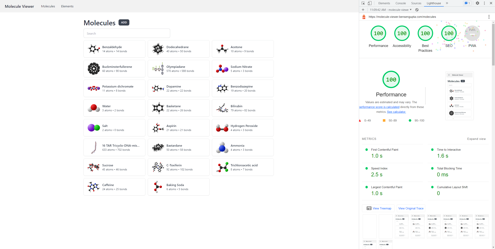
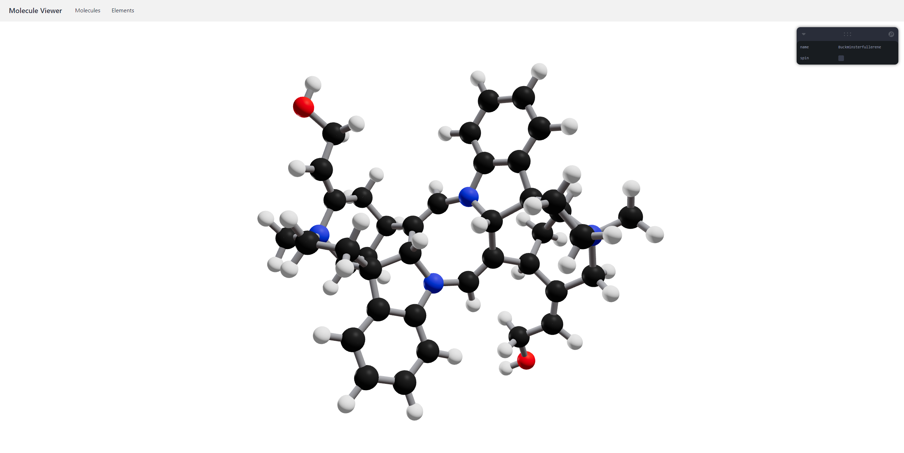

# Molecule viewer

View and manipulate 3D models of molecules and compounds, allowing you to gain
a better understanding of their structure, properties, and interactions.

## Screenshots




## Getting Started

1. Create a [Planetscale](https://planetscale.com/) account or setup a MySQL database.
2. Create a [Prisma Cloud](https://cloud.prisma.io/) account and setup accelerate with your database.
3. Copy `.env.example` to `.env` and replace `DATABASE_URL` with your Prisma accelerate url, and `DIRECT_URL` with your database url.
4. Push the schema to the database
   ```bash
   yarn prisma db push
   ```
5. (Optional) Seed the database
   ```bash
   # WARNING: THIS WILL DELETE ALL CONTENTS OF THE DATABASE
   yarn prisma db seed
   ```
6. Install project dependencies
   ```bash
   yarn
   ```
7. Generate Prisma Client
   ```bash
   yarn gen
   ```
8. Finally, run the development server
   ```bash
   yarn dev
   ```
   Open [http://localhost:3000](http://localhost:3000) with your browser to see the result.
